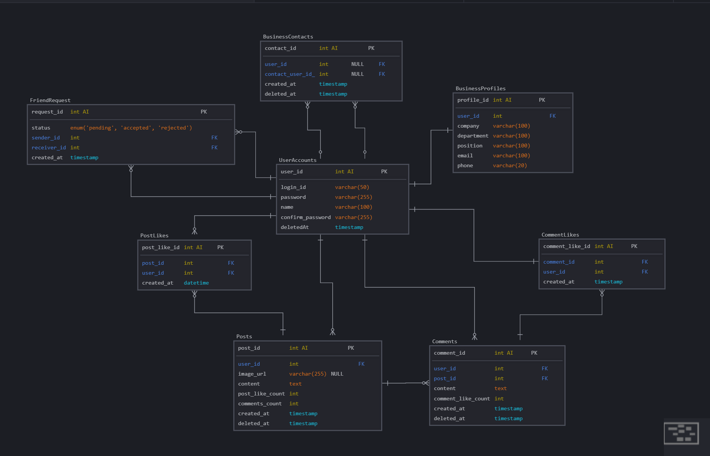

### 사용 버전
- **Node.js**: `v20.15.0`
- **NestJS**: `^10.0.0`
- **MySQL**: `8.0.39`
- **TypeORM**: `^0.3.20`

### ERD 설계도


### API 명세서
<details>
<summary>API 명세서 펼치기/접기</summary>

## 1. 인증 및 사용자 관리
<details>
<summary>1.1 아이디 중복 검사</summary>

- **엔드포인트**: GET /auth/check-id/{login_id}
- **응답**:
    - 사용 **가능** (200 OK):
        
        ```json
        {
          "statusCode": 200,
          "message": "사용 가능한 아이디입니다."
        }
        ```
        
    - 사용 **불가** (200 OK):
        
        ```json
        {
          "statusCode": 200,
          "message": "이미 사용 중인 아이디입니다."
        }
        ```
</details>        

<details>
<summary>1.2 회원가입</summary>

- **엔드포인트**: POST /auth/register
- **요청 본문**:
    
    ```json
    {
      "login_id": "String",
      "password": "String",
      "confirmPassword": "String",
      "name": "String",
      "company": "String",
      "department": "String",
      "position": "String",
      "email": "String",
      "phone": "String"
    }
    ```
    
- **응답**:
    - **성공** (201 OK):
        
        ```json
        {
          "statusCode": 201,
          "message": "회원가입이 성공적으로 완료되었습니다.",
          "userId": "Number"
        }
        ```
        
    
    - **아이디 중복** (400 Bad Request):
        
        ```json
        {
          "statusCode": 400,
          "message": "이미 존재하는 아이디입니다.",
          "error": "Bad Request"
        }
        ```
        
    - **비밀번호 불일치** (400 Bad Request)
    - **서버 내부 에러**
        
        ```json
        {
          "statusCode": 400,
          "message": "비밀번호와 확인 비밀번호가 일치하지 않습니다.",
          "error": "Bad Request"
        }
        ```
</details>        

<details>
<summary>1.3 로그인</summary>

- **엔드포인트**: POST /auth/login
- **요청 본문**:
    
    ```json
    {
      "login_id": "String",
      "password": "String"
    }
    
    ```
    
- **응답**:
    - 성공 (200 OK):
        
        ```json
        {
          "statusCode": 200,
          "message": "로그인 성공",
          "token": "JWT_TOKEN",
          "userId": "Number"
        }
        
        ```
        
    - 실패 (401 Unauthorized):
        
        ```json
        {
          "statusCode": 401,
          "message": "아이디 또는 비밀번호가 잘못되었습니다.",
          "error": "Unauthorized"
        }
        ```
</details>        

## 2. 게시물 조회 (통합 엔드포인트)

<details>
<summary>2.1 피드 조회 (메인 페이지, 내 게시물, 특정 유저 게시물 조회)</summary>

- **엔드포인트**: `GET /posts`
- **헤더**: `Authorization: Bearer {JWT_TOKEN}`
- **쿼리 파라미터**:
    - `sort`: `"latest"`, `"likes"`, `"comments"` (정렬 기준 선택, 기본값은 `"latest"`)
    - `filter`: `"all"`, `"own"`, `"specific"` (게시물 필터링)
    - `specificUserId`: 특정 유저 게시물 조회 시 필요한 유저 ID

### **요청 예시**:

- **메인 페이지 (본인 + 인맥 게시물)**:
    
    ```sql
    GET /posts?filter=all&sort=latest
    ```
    
- **내 게시물 조회 (마이 게시물)**:
    
    ```bash
    GET /posts?filter=own&sort=latest
    ```
    
- **특정 유저 페이지 (특정 유저 게시물)**:
    
    ```sql
    GET /posts?filter=specific&specificUserId=123&sort=comments
    ```
    

### **응답 예시**:

### 성공 (200 OK):

```json
{
  "statusCode": 200,
  "message": "피드를 성공적으로 조회했습니다.",
  "posts": [
    {
      "postId": 123,
      "createrId": 456,
      "createrName": "홍길동",
      "createdAt": "2024-09-18T12:34:56.000Z",
      "imageUrl": "https://example.com/image.jpg",
      "isOwnPost": true},
    {
      "postId": 124,
      "createrId": 789,
      "createrName": "김철수",
      "createdAt": "2024-09-18T13:00:00.000Z",
      "imageUrl": "https://example.com/image2.jpg",
      "isOwnPost": false}
  ]
}
```

### 잘못된 파라미터 (400 Bad Request):

```json
{
  "statusCode": 400,
  "message": "잘못된 요청입니다. specificUserId가 필요합니다.",
  "error": "Bad Request"
}
```

### 게시물 없음 (404 Not Found):

```json
{
  "statusCode": 404,
  "message": "해당 게시물을 찾을 수 없습니다.",
  "error": "Not Found"
}
```

---
</details>

<details>
<summary>2.2 게시물 상세 조회</summary>

- **엔드포인트**: `GET /posts/{postId}`
- **헤더**: `Authorization: Bearer {JWT_TOKEN}`

### **응답 예시**:

### 성공 (200 OK):

```json
{
  "statusCode": 200,
  "message": "게시물을 성공적으로 조회했습니다.",
  "postId": 123,
  "createrId": 456,
  "createrName": "홍길동",
  "createdAt": "2024-09-18T12:34:56.000Z",
  "imageUrl": "https://example.com/image.jpg",
  "content": "이 게시물의 내용입니다.",
  "likesCount": 42,
  "commentsCount": 10,
  "isOwnPost": true,
  "comments": [
    {
      "commentId": 1,
      "authorName": "김철수",
      "content": "멋진 게시물이네요!",
      "createdAt": "2024-09-18T12:45:00.000Z"
    },
    {
      "commentId": 2,
      "authorName": "이영희",
      "content": "좋은 글 감사합니다.",
      "createdAt": "2024-09-18T13:00:00.000Z"
      "likeCount": "2"
    }
  ],
  "likes": [
    {
      "userId": 789,
      "userName": "김철수"
    },
    {
      "userId": 890,
      "userName": "이영희"
    }
  ]
}
```

### 유효하지 않은 게시물 ID (400 Bad Request):

```json
{
  "statusCode": 400,
  "message": "유효하지 않은 게시물 ID입니다.",
  "error": "Bad Request"
}
```

### 게시물 없음 (404 Not Found):

```json
{
  "statusCode": 404,
  "message": "해당 게시물을 찾을 수 없습니다.",
  "error": "Not Found"
}
```
</details>

## 3. 게시물 관리

<details>
<summary>3.1 게시물 작성</summary>

- **엔드포인트**: POST /posts
- **헤더**: Authorization: Bearer {JWT_TOKEN}
- **요청 본문**:
    - **Form Data**:
        - `content`: String (필수) - 게시물 내용
        - `image`: File (선택) - 업로드할 이미지 파일
- **응답**:
    - **성공** (201 Created):
        
        ```json
        {
          "statusCode": 201,
          "message": "게시물이 성공적으로 작성되었습니다.",
          "postId": "Number"
        }
        ```
        
    - **실패** (400 Bad Request):
        
        ```json
        {
          "statusCode": 400,
          "message": "게시물 작성에 실패했습니다. 필수 필드를 확인해주세요.",
          "error": "Bad Request"
        }
        ```
</details>        

<details>
<summary>3.2 게시물 수정</summary>

- **엔드포인트**: PUT /posts/{postId}
- **헤더**: Authorization: Bearer {JWT_TOKEN}
- **요청 본문**:
    - **Form Data**:
        - `content`: String (선택) - 게시물 내용
        - `image`: File (선택) - 새로 업로드할 이미지 파일
- **응답**:
    - **성공** (200 OK):
        
        ```json
        {
          "statusCode": 200,
          "message": "게시물이 성공적으로 수정되었습니다."
        }
        ```
        
    - **실패** (400 Bad Request):
        
        ```json
        {
          "statusCode": 400,
          "message": "게시물 수정에 실패했습니다. 유효한 데이터를 입력해주세요.",
          "error": "Bad Request"
        }
        ```
        
    - **실패** (404 Not Found):
        
        ```json
        {
          "statusCode": 404,
          "message": "게시물을 찾을 수 없습니다.",
          "error": "Not Found"
        }
        
        ```
</details>        

<details>
<summary>3.3 게시물 삭제</summary>

- **엔드포인트**: DELETE /posts/{postId}
- **헤더**: Authorization: Bearer {JWT_TOKEN}
- **응답**:
    - **성공** (200 OK):
        
        ```json
        {
          "statusCode": 200,
          "message": "게시물이 성공적으로 삭제되었습니다."
        }
        ```
        
    - **실패** (404 Not Found):
        
        ```json
        {
          "statusCode": 404,
          "message": "게시물을 찾을 수 없습니다.",
          "error": "Not Found"
        }
        ```
</details>        

<details>
<summary>3.4 게시물 좋아요</summary>

- **엔드포인트**: POST /posts/{postId}/like
- **헤더**: Authorization: Bearer {JWT_TOKEN}
- **응답**:
    - **성공** (200 OK):
        
        ```json
        {
          "statusCode": 200,
          "message": "게시물에 좋아요를 눌렀습니다.",
          "likeCount": "Number"
        }
        ```
        
    - **성공** (200 OK) - 좋아요 취소:
        
        ```json
        {
          "statusCode": 200,
          "message": "게시물 좋아요를 취소했습니다.",
          "likeCount": "Number"
        }
        ```
        
    - **실패** (404 Not Found):
        
        ```json
        {
          "statusCode": 404,
          "message": "게시물을 찾을 수 없습니다.",
          "error": "Not Found"
        }
        ```
 </details>       

## 4. 댓글관리

<details>
<summary>댓글 작성</summary>

- **엔드포인트**: POST /posts/{postId}/comments
- **헤더**: Authorization: Bearer {JWT_TOKEN}
- **요청 본문**:
    
    ```json
    {
      "content": "String"
    }
    ```
    
- **응답**:
    - **성공** (201 Created):
        
        ```json
        {
          "statusCode": 201,
          "message": "댓글이 성공적으로 작성되었습니다.",
          "commentId": "Number"
        }
        ```
        
    - **실패** (400 Bad Request):
        
        ```json
        {
          "statusCode": 400,
          "message": "댓글 작성에 실패했습니다. 내용을 입력해주세요.",
          "error": "Bad Request"
        }
        ```
</details>        

<details>
<summary>댓글 수정</summary>

- **엔드포인트**: PUT /posts/{postId}/comments/{commentId}
- **헤더**: Authorization: Bearer {JWT_TOKEN}
- **요청 본문**:
    
    ```json
    {
      "content": "String"
    }
    ```
    

**응답**

- **성공** (200 OK):
    
    ```json
    {
      "statusCode": 200,
      "message": "댓글이 성공적으로 수정되었습니다."
    }
    ```
    
- **실패** (400 Bad Request):
    
    ```json
    {
      "statusCode": 400,
      "message": "댓글 수정에 실패했습니다. 유효한 내용을 입력해주세요.",
      "error": "Bad Request"
    }
    ```
    
- **실패** (404 Not Found):
    
    ```json
    {
      "statusCode": 404,
      "message": "댓글을 찾을 수 없습니다.",
      "error": "Not Found"
    }
    ```
</details>     

<details>
<summary>댓글 삭제</summary>

- **엔드포인트**: DELETE /posts/{postId}/comments/{commentId}
- **헤더**: Authorization: Bearer {JWT_TOKEN}
- **응답**:
    - **성공** (200 OK):
        
        ```json
        {
          "statusCode": 200,
          "message": "댓글이 성공적으로 삭제되었습니다."
        }
        ```
        
    - **실패** (404 Not Found):
        
        ```json
        {
          "statusCode": 404,
          "message": "댓글을 찾을 수 없습니다.",
          "error": "Not Found"
        }
        ```
</details>

<details>
<summary>댓글 좋아요</summary>

- **엔드포인트**: POST /posts/{postId}/comments/{commentId}/like
- **헤더**: Authorization: Bearer {JWT_TOKEN}
- **응답**:
    - **성공** (200 OK) - 좋아요 추가:
        
        ```json
        {
          "statusCode": 200,
          "message": "댓글에 좋아요를 눌렀습니다.",
          "likeCount": "Number"
        }
        ```
        
    - **성공** (200 OK) - 좋아요 취소:
        
        ```json
        {
          "statusCode": 200,
          "message": "댓글 좋아요를 취소했습니다.",
          "likeCount": "Number"
        }
        ```
        
    - **실패** (404 Not Found):
        
        ```json
        {
          "statusCode": 404,
          "message": "댓글을 찾을 수 없습니다.",
          "error": "Not Found"
        }

        ```
</details>        

## 5. 명함 관리

<details>
<summary>5.1 명함 리스트 조회</summary>

- **엔드포인트**: GET /contacts
- **헤더**: `Authorization: Bearer {JWT_TOKEN}`
- **응답**:
    - 성공 (200 OK):
        
        ```json
        {
          "statusCode": 200,
          "message": "명함 리스트를 성공적으로 조회했습니다.",
          "contacts": [
            {
              "userId": "Number",
              "name": "String",
              "company": "String",
              "department": "String"
            }
          ]
        }
        ```
        
    - 실패 (400 Bad Request):
        
        ```json
        {
          "statusCode": 400,
          "message": "잘못된 요청입니다.",
          "error": "Bad Request"
        }
        ```
        
    - 실패 (404 Not Found):
        
        ```json
        {
          "statusCode": 404,
          "message": "명함 리스트를 찾을 수 없습니다.",
          "error": "Not Found"
        }
        ```
</details>        

<details>
<summary>5.2 명함 상세 정보 조회</summary>

- **엔드포인트**: GET /contacts/{userId}
- **헤더**: `Authorization: Bearer {JWT_TOKEN}`
- **응답**:
    - 성공 (200 OK):
        
        ```json
        {
          "statusCode": 200,
          "message": "명함 상세 정보를 성공적으로 조회했습니다.",
          "contact": {
            "userId": "Number",
            "name": "String",
            "company": "String",
            "department": "String",
            "position": "String",
            "email": "String",
            "phone": "String"
          }
        }
        ```
        
    - 실패 (400 Bad Request):
        
        ```json
        {
          "statusCode": 400,
          "message": "유효하지 않은 사용자 ID입니다.",
          "error": "Bad Request"
        }
        ```
        
    - 실패 (404 Not Found):
        
        ```json
        {
          "statusCode": 404,
          "message": "해당 사용자의 명함을 찾을 수 없습니다.",
          "error": "Not Found"
        }
        ```
</details>        

<details>
<summary>5.3 인맥 추가 (명함 추가)</summary>

- **엔드포인트**: POST /contacts
- **헤더**: `Authorization: Bearer {JWT_TOKEN}`
- **요청 본문**:
    
    ```json
    {
      "loginId": "Number"
    }
    ```
    
- **응답**:
    - 성공 (201 Created):
        
        ```json
        {
          "statusCode": 201,
          "message": "인맥이 요청이 성공적으로 추가되었습니다.",
          "contactId": "Number"
        }
        ```
        
    - 실패 (400 Bad Request):
        
        ```json
        {
          "statusCode": 400,
          "message": "대상 사용자를 찾을 수 없습니다.",
          "error": "Bad Request"
        }
        ```
        
    - 실패 (409 Conflict):
        
        ```json
        {
          "statusCode": 409,
          "message": "이미 인맥 요청을 보냈거나 인맥 관계가 존재합니다.",
          "error": "Conflict"
        }
        ```
 </details>        

<details>
<summary>5.4 인맥 요청 수락</summary>

- **엔드포인트**: POST /contacts/accept/{requestId}
- **헤더**: `Authorization: Bearer {JWT_TOKEN}`
- **응답**:
    - 성공 (200 OK):

```json
{
  "statusCode": 200,
  "message": "인맥 요청이 수락되었습니다.",
  "contactId": "Number"// 새로 생성된 인맥 관계의 ID
}
```

- 실패 (400 Bad Request):

```json
{
  "statusCode": 400,
  "message": "유효하지 않은 요청입니다.",
  "error": "Bad Request"
}
```

- 실패 (404 Not Found):

```json
{
  "statusCode": 404,
  "message": "해당 인맥 요청을 찾을 수 없습니다.",
  "error": "Not Found"
}
```
</details>

<details>
<summary>5.5 인맥 요청 거절</summary>

- **엔드포인트**: POST /contacts/reject/{requestId}
- **헤더**: `Authorization: Bearer {JWT_TOKEN}`
- **응답**:
    - 성공 (200 OK):

```json
{
  "statusCode": 200,
  "message": "인맥 요청이 거절되었습니다."
}
```

- 실패 (400 Bad Request):

```json
{
  "statusCode": 400,
  "message": "유효하지 않은 요청입니다.",
  "error": "Bad Request"
}
```

- 실패 (404 Not Found):

```json
{
  "statusCode": 404,
  "message": "해당 인맥 요청을 찾을 수 없습니다.",
  "error": "Not Found"
}
```
</details>

<details>
<summary>5.6 받은 인맥 요청 목록 조회</summary>

- **엔드포인트**: GET /contacts/requests/received
- **헤더**: `Authorization: Bearer {JWT_TOKEN}`
- **응답**:
    - 성공 (200 OK):

```json
{
  "statusCode": 200,
  "message": "받은 인맥 요청 목록을 성공적으로 조회했습니다.",
  "requests": [
    {
      "requestId": "Number",
      "senderLoginId": "String",
      "senderName": "String",
      "requestedAt": "DateTime"
    }
  ]
}
```

- 실패 (400 Bad Request):

```json
{
  "statusCode": 400,
  "message": "요청 처리 중 오류가 발생했습니다.",
  "error": "Bad Request"
}
```
</details>

<details>
<summary>5.7 보낸 인맥 요청 목록 조회</summary>

- **엔드포인트**: GET /contacts/requests/sent
- **헤더**: `Authorization: Bearer {JWT_TOKEN}`
- **응답**:
    - 성공 (200 OK):

```json
{
  "statusCode": 200,
  "message": "보낸 인맥 요청 목록을 성공적으로 조회했습니다.",
  "requests": [
    {
      "requestId": "Number",
      "senderLoginId": "String",
      "senderName": "String",
      "requestedAt": "DateTime"
    }
  ]
}
```

- 실패 (400 Bad Request):

```json
{
  "statusCode": 400,
  "message": "요청 처리 중 오류가 발생했습니다.",
  "error": "Bad Request"
}
```
</details>

<details>
<summary>5.8 인맥 삭제 (명함 삭제)</summary>

- **엔드포인트**: DELETE /contacts/{contactId}
- **헤더**: `Authorization: Bearer {JWT_TOKEN}`
- **응답**:
    - 성공 (200 OK):
        
        ```json
        {
          "statusCode": 200,
          "message": "인맥이 성공적으로 삭제되었습니다."
        }
        ```
        
    - 실패 (400 Bad Request):
        
        ```json
        {
          "statusCode": 400,
          "message": "유효하지 않은 인맥 ID입니다.",
          "error": "Bad Request"
        }
        ```
        
    - 실패 (404 Not Found):
        
        ```json
        {
          "statusCode": 404,
          "message": "해당 인맥을 찾을 수 없습니다.",
          "error": "Not Found"
        }
        ```
</details>        

## 6. 사용자 정보 관리

<details>
<summary>6.1 나의 명함 정보 수정</summary>
  
- **엔드포인트**: PUT /users/businessprofile
- **헤더**: `Authorization: Bearer {JWT_TOKEN}`
- **요청 본문**:
    
    ```json
    {
      "name": "String",
      "company": "String",
      "department": "String",
      "position": "String",
      "email": "String",
      "phone": "String"
    }
    ```
    
- **응답**:
    - 성공 (200 OK):
        
        ```json
        {
          "statusCode": 200,
          "message": "프로필 정보가 성공적으로 수정되었습니다."
        }
        ```
        
    - 실패 (400 Bad Request):
        
        ```json
        {
          "statusCode": 400,
          "message": "잘못된 요청입니다. 유효한 정보를 입력해주세요.",
          "error": "Bad Request"
        }
        ```
</details>         

<details>
<summary>6.2 비밀번호 변경 </summary>

- **엔드포인트**: PUT /users/password
- **헤더**: `Authorization: Bearer {JWT_TOKEN}`
- **요청 본문**:
    
    ```json
    {
      "currentPassword": "String",
      "newPassword": "String",
      "confirmNewPassword": "String"
    }
    ```
    
- **응답**:
    - 성공 (200 OK):
        
        ```json
        {
          "statusCode": 200,
          "message": "비밀번호가 성공적으로 변경되었습니다."
        }
        ```
        
    - 실패 (400 Bad Request):
        
        ```json
        {
          "statusCode": 400,
          "message": "새 비밀번호와 확인 비밀번호가 일치하지 않습니다.",
          "error": "Bad Request"
        }
        ```
        
    - 실패 (401 Unauthorized):
        
        ```json
        {
          "statusCode": 401,
          "message": "현재 비밀번호가 올바르지 않습니다.",
          "error": "Unauthorized"
        }
        ```
</details>        

<details>
<summary>6.3 회원 탈퇴</summary>

- **엔드포인트**: DELETE /users
- **헤더**: `Authorization: Bearer {JWT_TOKEN}`
- **요청 본문**:

```json
{
  "password": "String"
}
```

- **응답**:
    - 성공 (200 OK):

```json
{
  "statusCode": 200,
  "message": "회원 탈퇴가 성공적으로 처리되었습니다."
}
```

- 실패 (400 Bad Request):

```json
{
  "statusCode": 400,
  "message": "회원 탈퇴 처리 중 오류가 발생했습니다.",
  "error": "Bad Request"
}
```

- 실패 (401 Unauthorized):

```json
{
  "statusCode": 401,
  "message": "비밀번호가 올바르지 않습니다.",
  "error": "Unauthorized"
}
```
</details>
</details>
